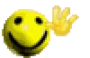

hi

im tazy. i am a hobby coder from down unda. i try to code while also doing my homework, so my consistency is NOT gauranteed.

and i am also a proud .dev domain owner, so [check it out](https://tazy.dev) (no preasure)

## Stuff I made

I made tinyff, it's tiny and ff. Really WIP. Looking for contributers and if you do you might get a cookie from me in 20 years 🍪

 \> \> \> \> \> \> \> \> \> \> \> \> \> \> \> \>  [github.com/TazyFoundSoup/tinyff](https://github.com/TazyFoundSoup/tinyff)  < < < < < < < < < < < < < < < <

## Dev stack

C/C++: Any day of the week  
Rust: I mean, it's ok  
Js: WHERES THE GODDAMN TYPE SAFETY  
Ts: Ah, there it is  
Python: Way to overrated  
Lua: Way to underrated  
Lisp: (I)(Have)(Never)(Tried)(It)(.)  
LOLCODE: // TODO: Learn  
Powerpoint animations: How is this not a language, it's actually the goat  

### What am i doing right now
Listening to star starer and cici (deserves more attention, check them out plsss)
